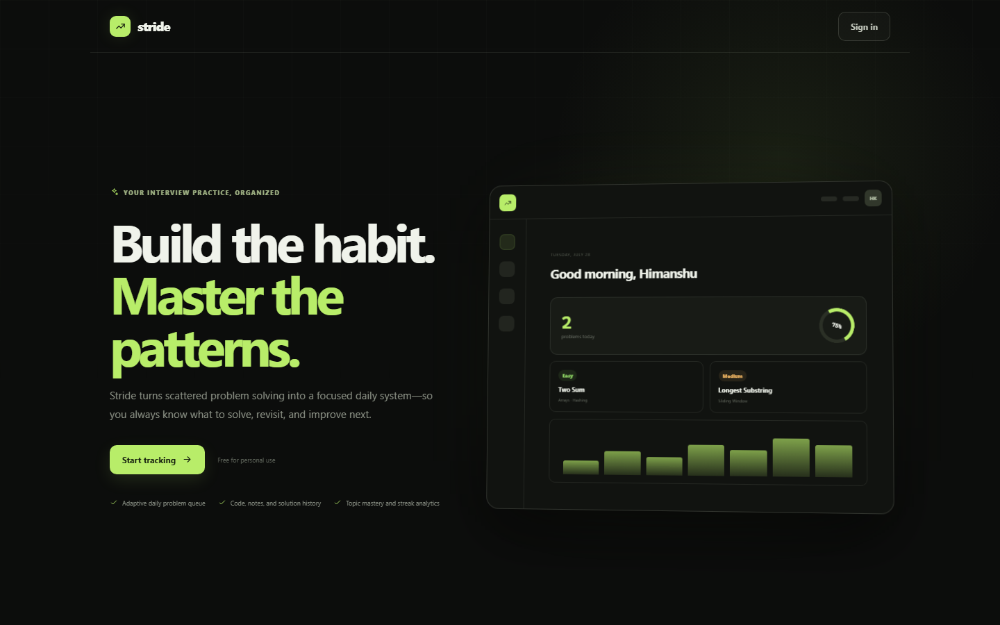
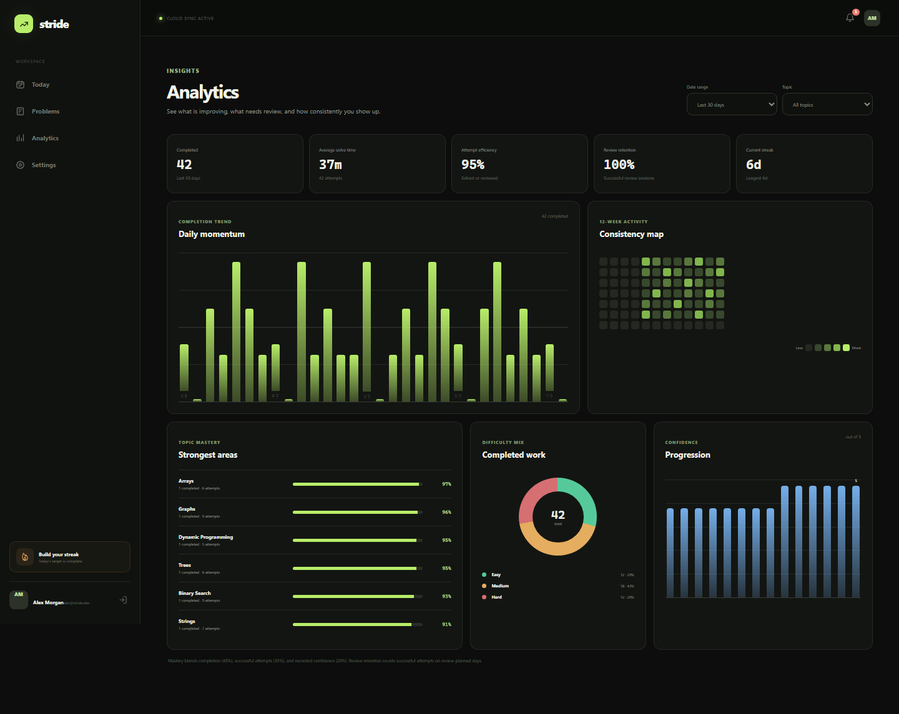
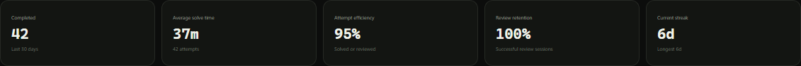
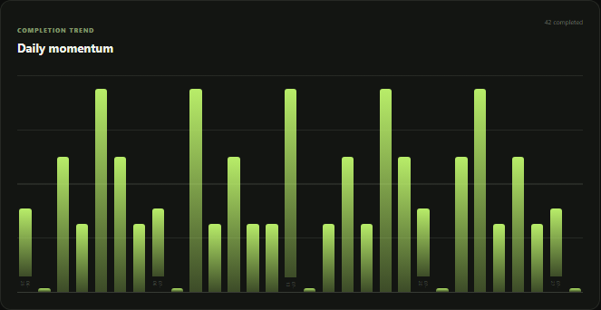
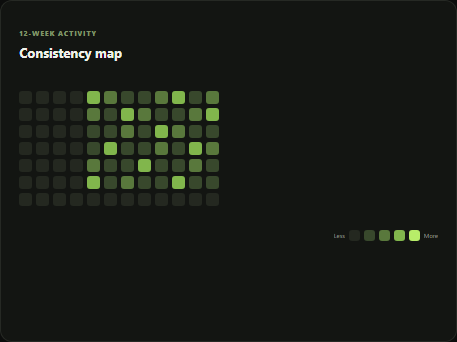
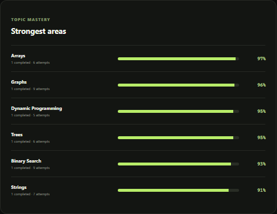
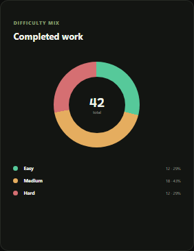
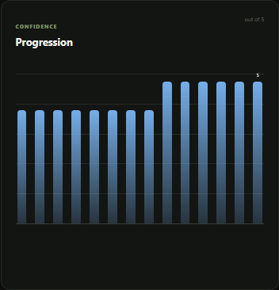
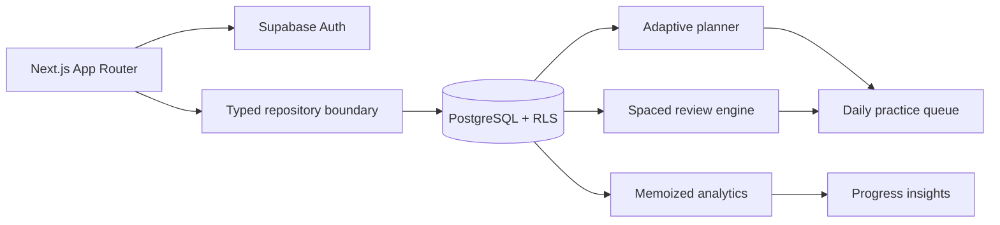

<div align="center">
  

  <br />
  <br />

  # Stride

  **The intelligent practice system for people who want to get genuinely good at DSA.**

  Turn scattered problem solving into a focused daily habit—with adaptive plans, a serious coding workspace, spaced review, and analytics that show what is actually improving.

  <p>
    
    
    
    
    
  </p>
</div>

---

## Your interview preparation should have a system

Most DSA tools give you another list of problems. Stride gives you a feedback loop.

It decides what deserves attention today, keeps every solution and learning note in one place, brings weak problems back at the right time, and turns your practice history into clear signals about mastery, consistency, and confidence.

```text
Plan intentionally → Solve deeply → Reflect honestly → Review on time → Improve visibly
```

## See the product

These screenshots were captured from the actual running application with deterministic sample activity—no design mockups.

### Analytics that explain your progress



### Signal, not vanity metrics

Understand daily and weekly momentum, topic mastery, solve efficiency, review retention, confidence progression, and difficulty balance. Filter every insight by time range and topic.

#### Progress at a glance



#### Momentum and consistency

<table>
  <tr>
    <td width="58%">
      
    </td>
    <td width="42%">
      
    </td>
  </tr>
  <tr>
    <td align="center"><sub>Daily completion momentum</sub></td>
    <td align="center"><sub>12-week consistency map</sub></td>
  </tr>
</table>

#### Mastery, balance, and confidence

<table>
  <tr>
    <td width="40%">
      
    </td>
    <td width="25%">
      
    </td>
    <td width="35%">
      
    </td>
  </tr>
  <tr>
    <td align="center"><sub>Topic mastery</sub></td>
    <td align="center"><sub>Difficulty balance</sub></td>
    <td align="center"><sub>Confidence progression</sub></td>
  </tr>
</table>

## Everything needed to build mastery

### An adaptive plan, every day

Stride creates one focused queue for the user’s local calendar day. The planner prioritizes:

1. Reviews that are already due
2. Problems from weaker topics
3. Unfinished backlog work
4. New curated suggestions

Users can add, remove, reorder, skip, replace, start, or complete any item without losing the structure of the plan.

### A real problem-solving workspace

- Language-aware CodeMirror editor for TypeScript, JavaScript, Python, Java, C++, and Go
- Debounced cloud autosave with offline draft protection
- Approach notes, general notes, and complexity analysis
- Immutable solution revision history with restoration
- Attempt logging with result, duration, language, confidence, and reflections
- Optimistic progress updates without disruptive page refreshes

### Review that adapts to performance

Every attempt feeds the review engine. Failed and low-confidence work returns quickly; confident solutions receive longer intervals. Review completion updates the daily plan, problem progress, analytics, and future review date together.

### A calm accountability layer

Stride surfaces timely in-app reminders for:

- Unfinished daily targets
- Overdue reviews
- Problems stalled for seven or more days
- A current streak at risk

### Analytics built for action

| Insight | What it answers |
| --- | --- |
| Daily and weekly trends | Am I building consistent momentum? |
| Activity heatmap | When do I actually show up? |
| Topic mastery | Which concepts are strong or weak? |
| Difficulty distribution | Am I practicing at the right level? |
| Average solve time | Is my speed improving? |
| Attempt efficiency | How often do sessions end successfully? |
| Confidence progression | Does my self-assessment improve with practice? |
| Review retention | Do solutions stick when they return? |
| Current and longest streak | How durable is my habit? |

Topic mastery blends completion (45%), successful attempts (35%), and recorded confidence (20%). Review retention measures successful attempts on review-planned days. Analytics are memoized, and chart components avoid unnecessary rerenders.

## Product principles

- **Focused by default.** The next useful action should always be obvious.
- **Cloud-synced, not cloud-dependent.** Server data is authoritative; unsynced editor drafts survive locally.
- **Private by architecture.** PostgreSQL row-level security isolates every user-owned record.
- **Fast enough to disappear.** Server-rendered routes, parallel data loading, optimistic updates, and memoized insights keep the interface responsive.
- **Accessible from the start.** Keyboard navigation, visible focus, semantic states, reduced motion, responsive layouts, skeletons, toasts, confirmations, and useful empty states are built in.

## Architecture



| Layer | Technology |
| --- | --- |
| Product | Next.js 16 App Router, React 19, TypeScript |
| Data and auth | Supabase Auth, PostgreSQL, Row-Level Security |
| Editor | CodeMirror 6 with language extensions |
| Quality | Node test runner, ESLint, TypeScript, Playwright |
| UX | Responsive CSS, accessible interaction states, reduced motion |

## Run locally

### Prerequisites

- Node.js 20.9+
- npm
- A Supabase project

### 1. Install

```bash
git clone https://github.com/himanchalkaushale/Stride-DSA-Tracker.git
cd Stride-DSA-Tracker
npm install
```

### 2. Create the database

Run these migrations in order using the Supabase SQL editor:

```text
supabase/migrations/0001_phase_one.sql
supabase/migrations/0002_phase_three.sql
```

They create the complete schema, indexes, triggers, RLS policies, planner state, and the curated 24-problem starter roadmap.

### 3. Configure authentication

In **Supabase → Authentication → URL Configuration**:

- Set the site URL to `http://localhost:3000`
- Add `http://localhost:3000/auth/callback` as a redirect URL
- Enable email authentication
- Optionally enable Google OAuth and configure its credentials

### 4. Configure the application

Copy `.env.example` to `.env.local`:

```env
NEXT_PUBLIC_SUPABASE_URL=https://your-project.supabase.co
NEXT_PUBLIC_SUPABASE_ANON_KEY=your-anon-key
NEXT_PUBLIC_APP_URL=http://localhost:3000
```

Only the anonymous Supabase key belongs in a `NEXT_PUBLIC_*` variable. Never expose a service-role key to browser code.

### 5. Start Stride

```bash
npm run dev
```

Open [http://localhost:3000](http://localhost:3000), sign in, and finish the short onboarding flow.

## Quality gates

```bash
npm run typecheck
npm run lint
npm test
npm run build
npm audit --omit=dev
```

The automated browser acceptance flow covers the entire customer journey:

```text
Sign in → Onboard → Receive plan → Add problem → Save code and notes
→ Record attempt → Complete problem → Schedule review → Verify analytics
```

Run it against a dedicated migrated Supabase test project:

```bash
npx playwright install chromium
npm run test:e2e
```

Required test-runner variables:

```env
E2E_USER_EMAIL=acceptance@example.com
SUPABASE_SERVICE_ROLE_KEY=server-only-test-key
PLAYWRIGHT_BASE_URL=http://127.0.0.1:3000
```

The service-role key is used only by Playwright to create the test magic link. Never commit it or add it to the production application environment.

## Security model

- Curated problems are globally readable by authenticated users and have no owner
- Custom problems are readable and mutable only by their owner
- Profiles, progress, daily tasks, attempts, and revisions are isolated by `auth.uid()`
- Protected server routes validate the session with `supabase.auth.getUser()`
- Session cookies are refreshed through the Next.js proxy
- The browser never receives privileged database credentials

An additional two-user isolation procedure is available at `supabase/tests/rls_isolation.sql`.

## Deploy

Stride can run on any Next.js-compatible platform.

1. Create the production Supabase project and apply both migrations.
2. Add `https://YOUR_DOMAIN/auth/callback` to the Supabase redirect URLs.
3. Configure:

   ```env
   NEXT_PUBLIC_SUPABASE_URL=https://YOUR_PROJECT.supabase.co
   NEXT_PUBLIC_SUPABASE_ANON_KEY=YOUR_PRODUCTION_ANON_KEY
   NEXT_PUBLIC_APP_URL=https://YOUR_DOMAIN
   ```

4. Run every quality gate.
5. Deploy and run the Playwright acceptance flow against the production URL.

The production runtime does not require a service-role key.

## Backup and recovery

Use Supabase backups or point-in-time recovery as the primary recovery mechanism. Before migrations and major releases, create a logical backup:

```bash
pg_dump --format=custom --no-owner --no-acl "$DATABASE_URL" --file=stride-$(date +%Y-%m-%d).dump
```


Always test restoration in a separate project:

```bash
pg_restore --clean --if-exists --no-owner --no-acl \
  --dbname="$RESTORE_DATABASE_URL" stride-YYYY-MM-DD.dump
```

Portable user exports should include `profiles`, owned `problems`, `user_problems`, `daily_tasks`, `attempts`, and `solution_revisions`, filtered by user UUID. Curated problems can be recreated from migrations.

## Repository map

```text
src/app/                 Routes, authentication, onboarding, and product views
src/components/          Interactive product and shell components
src/lib/                 Planner, analytics, Supabase, and persistence logic
src/types/               Database and domain types
supabase/migrations/     Versioned database schema
supabase/tests/          RLS isolation verification
tests/e2e/               Full browser acceptance journey
docs/images/             Real product screenshots
```

---

<div align="center">
  <strong>Stride turns practice into progress you can see.</strong>
  <br />
  <sub>Built for focused learners preparing for high-stakes technical interviews.</sub>
</div>
